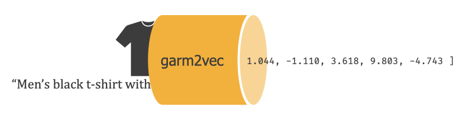
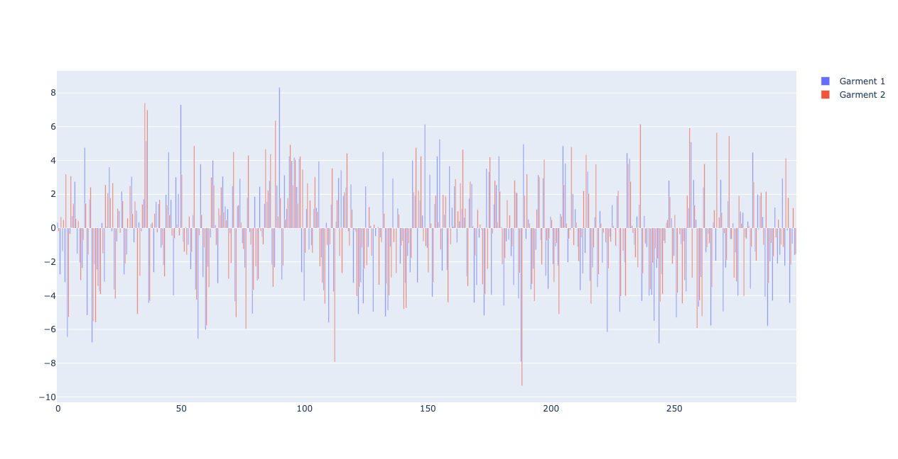

<div align="center">
  <h1>garm2vec</h1>
  <br><br/>
<p align="center">

<a href="https://github.com/connor-mccarthy/<repo-name>/workflows/Python%20Workflow/badge.svg">
    /workflows/Python%20Workflow/badge.svg" alt="Python Workflow" />
</a>
<a href="https://img.shields.io/badge/python-3.7.10-blue.svg">
    
</a>
<a href="https://img.shields.io/badge/code%20style-black-000000.svg">
    
</a>
<p>A multi-input neural network model for generating dense clothing embedding vectors.</p>
</div>



Garm2Vec is a neural network model for creating 300 dimensional clothing embeddings from pairs of an image and text description of an article of clothing.

The embeddings capture a compressed representation of the visual image and the semantics of the clothing description, with an emphasis on the following aspects of the clothing:
* gender
* season
* article type
* usage
* category

The model builds on Microsoft's [ResNet50](https://arxiv.org/abs/1512.03385) and Google's [BERT](https://arxiv.org/abs/1810.04805v2) via transfer learning. It is trained on a multi-output classification task that predicts the aspects of the clothing bulleted above.

Model architecture:
* [embedding architecture]()
* [classification architecture (for training)](./full_classification_architecture.png)
## Installation
```sh
pip install git+https://github.com/connor-mccarthy/garm2vec.git
```

## Usage
### Command line
```sh
garm2vec vector '/path/to/your/file.jpg' 'Turtle Check Men Navy Blue Shirt'

>>> [ 3.32198739e-01 -2.75256515e+00 -1.36471272e+00 -3.20780230e+00, ...]
```

### Python
```python
from garm2vec import Garm2Vec

g2v = Garm2Vec()
image_path="/path/to/your/file.jpg"
description="Turtle Check Men Navy Blue Shirt"

vector = g2v.get_one([image_path, description])
print(vector)
>>> [ 3.32198739e-01 -2.75256515e+00 -1.36471272e+00 -3.20780230e+00, ...]

vectors = g2v.get_many([[image_path, description], [image_path, description]])
print(vectors)
>>> [[ 3.32198739e-01 -2.75256515e+00 -1.36471272e+00 -3.20780230e+00, ...]

fig1 = g2v.plot_one([image_path, description])
fig2 = g2v.plot_many([[image_path, description], [image_path, description]])
```

The `.plot_one()` and `.plot_many()` functions plot one or more vectors for visual comparison of similarities:

